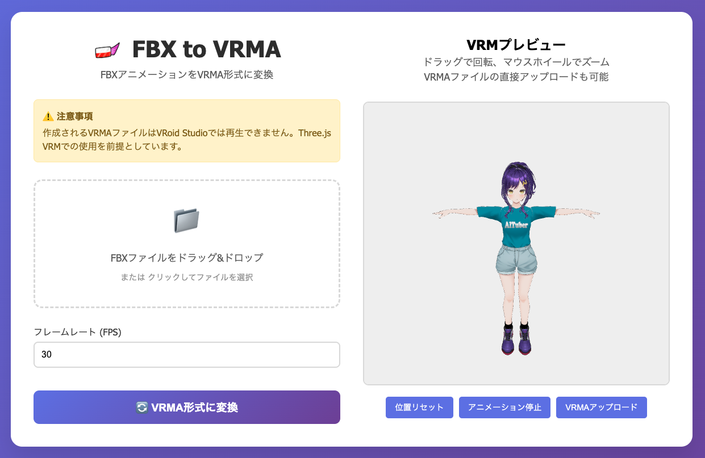

# FBX to VRMA Converter

FBXアニメーションファイルをVRMA形式に変換するWebアプリケーションです。



## 概要

このアプリケーションは、Mixamoなどで作成されたFBXアニメーションファイルを、VRMモデル用のVRMA（VRM Animation）形式に変換するためのツールです。変換されたVRMAファイルは、Three.js VRMライブラリで使用できます。

**⚠️ 注意事項**  
作成されるVRMAファイルはVRoid Studioでは再生できません。Three.js VRMでの使用を前提としています。

## 主な機能

- **FBXからVRMAへの変換**: FBXアニメーションファイルをVRMA形式に変換
- **リアルタイムプレビュー**: VRMモデルとアニメーションのリアルタイム表示
- **ドラッグ&ドロップ対応**: ファイルの簡単アップロード
- **直接VRMA再生**: 変換済みVRMAファイルの直接アップロードと再生
- **インタラクティブ操作**: マウスドラッグでの視点変更、ホイールでのズーム

## 使用技術

### フロントエンド
- HTML5/CSS3/JavaScript (ES6+)
- Three.js - 3Dレンダリング
- @pixiv/three-vrm - VRMモデル読み込み
- カスタムVRMAnimationローダー

### バックエンド
- Node.js
- Express.js - Webサーバー
- Multer - ファイルアップロード処理
- FBX2glTF - FBXからGLTF変換

## セットアップ

### 必要環境
- Node.js 16.0.0 以上
- 対応OS: macOS, Linux, Windows

### インストール

1. リポジトリをクローン
```bash
git clone <repository-url>
cd fbx2vrma-converter-ui
```

2. 依存関係をインストール
```bash
npm install
```

3. サーバーを起動
```bash
npm start
```

4. ブラウザで http://localhost:3000 にアクセス

## 使用方法

### FBXファイルの変換

1. **ファイルアップロード**
   - FBXファイルをドラッグ&ドロップするか、クリックしてファイルを選択
   - 対応形式: .fbx（最大100MB）

2. **設定調整**
   - フレームレート: 1-120FPS（デフォルト30FPS）

3. **変換実行**
   - "VRMA形式に変換"ボタンをクリック
   - 変換完了後、VRMAファイルをダウンロード

### VRMプレビュー

- **視点操作**: マウスドラッグで回転
- **ズーム**: マウスホイールで拡大・縮小
- **位置リセット**: ボタンクリックで初期位置に戻る
- **アニメーション制御**: 再生・停止の切り替え

### VRMAファイルの直接再生

- VRMプレビューエリアにVRMAファイルをドラッグ&ドロップ
- または"VRMAアップロード"ボタンからファイル選択
- 自動的にアニメーションが再生開始

## API エンドポイント

### POST /convert
FBXファイルをVRMA形式に変換

**リクエスト**
- Content-Type: multipart/form-data
- fbxFile: FBXファイル
- framerate: フレームレート（数値）

**レスポンス**
```json
{
  "success": true,
  "downloadUrl": "/download/filename.vrma",
  "directUrl": "/output/filename.vrma",
  "filename": "filename.vrma"
}
```

### GET /download/:filename
変換されたVRMAファイルのダウンロード

### GET /debug
システム情報とデバッグ情報の表示

## デプロイメント

### Render.com
プロジェクトには `render.yaml` 設定ファイルが含まれており、Render.comでの自動デプロイに対応しています。

### 手動デプロイ
```bash
npm run build
npm start
```

## サポートされるアニメーション形式

- **Mixamo**: mixamorig:プレフィックス付きボーン
- **標準FBX**: 標準的なヒューマノイドボーン構造
- **カスタムリグ**: 一般的なボーン命名規則に従ったもの

## トラブルシューティング

### 変換エラー
- FBXファイルにアニメーションデータが含まれているか確認
- ファイルサイズが100MB以下であることを確認
- Mixamo形式のボーン構造であることを確認

### アニメーション再生エラー
- VRMモデルが正しく読み込まれているか確認
- VRMAファイルのフォーマットが正しいか確認
- ブラウザのコンソールでエラーログを確認

## ライセンス

MIT License

## 貢献

プルリクエストや Issue の報告を歓迎します。
